## Hi there, I'm Darian 👋

🧑‍🎓 A 3rd year BSc (Hons) in Software Development student whose enthusiastic about learning new technologies and techniques!

- 🌱 I’m currently learning ... Advanced Data Structures &  Algorithms, C++, Operating Systems, Cloud Development
- 🤔 I’m looking for help with ... finding Software Development Internships
- 💬 Ask me about ... my Roll-A-Ball game
- 📫 How to reach me: [LinkedIn](https://www.linkedin.com/in/darian-byrne/)
- 😄 Pronouns: he/him
- ⚡ Fun fact: I was homeschooled throughout secondary school, which is when I discovered coding!

I have experience in ...
- Java
- JavaScript & TypeScript
- HTMl, CSS, PHP, Node.js
- MySQL, MariaDB
- Assembly
- Python
- C#, Unity
- Discord API
- and more...!

