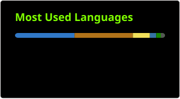

## Hi there, I'm Darian 👋

🧑‍🎓 A 4ᵗʰ year BSc (Hons) in Software Development student who's enthusiastic about learning new technologies and techniques!

- 🌱 I’m currently learning Concurrent Development, Data Science and Machine Learning, Agile Software Development & Verification
- 🤔 I’m looking for help with finding Software Development & Site Reliability internships or graduate programmes
- 💬 Ask me about my Roll-A-Ball game
- 📫 How to reach me: [LinkedIn](https://www.linkedin.com/in/darian-byrne/)
- 😄 Pronouns: he/him
- ⚡ Fun fact: I was homeschooled throughout secondary school, which is when I discovered coding!

I have experience in:
- Java
- JavaScript & TypeScript
- HTMl, CSS, PHP, Node.js, React.js
- MySQL, MariaDB, MongoDB
- Python
- C, C++
- Assembly
- C#, Unity
- Discord API
- and more...!

